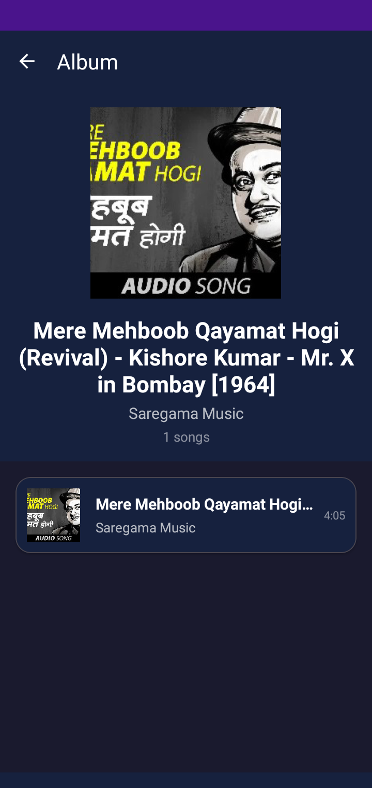
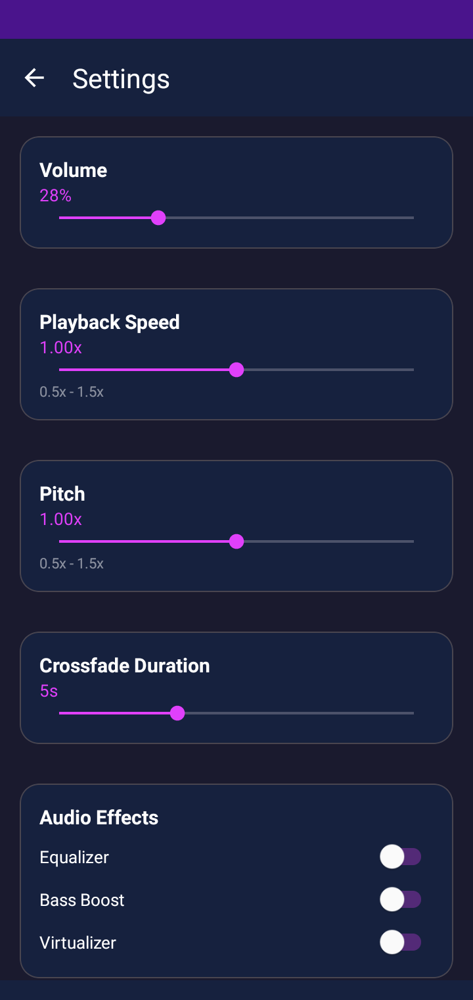

# 🎵 Musicq Music Player

<div align="center">


**A powerful, feature-rich local music player for Android with Material 3 design**
**Made with Claude 4.5 Sonnet**

[](https://www.android.com/)
[](https://android-arsenal.com/api?level=24)
[](LICENSE)

[Features](#features) • [Screenshots](#screenshots) • [Installation](#installation) • [Build](#build-from-source) • [Tech Stack](#tech-stack)

</div>

---

## ✨ Features

### 🎼 Core Playback
- **Local Music Library** - Scans and plays all audio files on your device
- **Album & Artist Management** - Organized library with album art support
- **Custom Playlists** - Create and manage unlimited playlists
- **Queue Management** - Shuffle and repeat modes
- **Background Playback** - Continues playing when app is minimized

### 🎨 User Interface
- **Material 3 Design** - Modern, expressive UI with dynamic colors
- **Fullscreen Player** - Immersive playback experience
- **Mini Player** - Quick controls at the bottom of the screen
- **WebGL Splash Animation** - Eye-catching startup with Three.js
- **Album Art Display** - Beautiful cover art throughout the app

### 🔧 Advanced Features
- **System Integration** - Quick Settings, lock screen, Android Auto support
- **Media Session API** - Full system media controls integration
- **Rich Notifications** - Playback controls in notification shade
- **Audio Effects** - Equalizer, Bass Boost, Virtualizer
- **Playback Controls** - Variable speed (0.5x-1.5x) and pitch adjustment
- **Metadata Viewer** - Detailed track information (bitrate, sample rate, format)

### ⚡ Performance
- **Battery Saver Mode** - Reduces power consumption by disabling effects
- **Efficient Scanning** - Fast music library indexing
- **Optimized Playback** - Minimal resource usage
- **Wake Lock Management** - Smart power management

### 🎛️ Customization
- **Volume Control** - Precise volume adjustment (0-100%)
- **Speed & Pitch** - Independent control for each
- **Crossfade Duration** - Smooth transitions between tracks
- **Audio Effects Toggle** - Enable/disable individual effects

---

## 📱 Screenshots

<div align="center" id="#screenshots">

|Launch Animation | Main Player | Fullscreen | Albums | Settings |
|-----------------|------------|------------|---------|----------|
|  | |  |  |  | 

</div>

---

## 🚀 Installation

### Download APK
1. Go to [Releases](https://github.com/Amorousstake5/Musicq/releases)
2. Download the latest `app-debug.apk`
3. Install on your Android device (Android 7.0+)

### Permissions Required
- **Read Media Audio** (Android 13+) / **Read External Storage** (Android 12-)
- **Foreground Service** - For background playback
- **Wake Lock** - To keep playing when screen is off
- **Post Notifications** - For playback controls

---

## 🛠️ Build from Source

### Prerequisites
- Android Studio Arctic Fox or newer
- JDK 8 or higher
- Android SDK (API 24+)
- Gradle 7.0+

### Steps
```bash
# Clone the repository
git clone https://github.com/Amorousstake5/Musicq.git

# Open in Android Studio
cd Musicq
# File → Open → Select the project directory

# Build the project
./gradlew assembleDebug

# Install on connected device
./gradlew installDebug
```

### Project Structure
```
Musicq/
├── app/
│   ├── src/
│   │   ├── main/
│   │   │   ├── java/com/example/harmoniq/
│   │   │   │   ├── MainActivity.java
│   │   │   │   ├── PlayerActivity.java
│   │   │   │   ├── FullPlayerActivity.java
│   │   │   │   ├── MusicService.java
│   │   │   │   ├── AlbumDetailActivity.java
│   │   │   │   ├── CreatePlaylistActivity.java
│   │   │   │   ├── SettingsActivity.java
│   │   │   │   ├── MetadataActivity.java
│   │   │   │   ├── CreditsActivity.java
│   │   │   │   ├── Models/
│   │   │   │   ├── Adapters/
│   │   │   │   └── Managers/
│   │   │   ├── res/
│   │   │   │   ├── layout/
│   │   │   │   ├── drawable/
│   │   │   │   ├── values/
│   │   │   │   └── menu/
│   │   │   ├── assets/
│   │   │   │   └── splash_animation.html
│   │   │   └── AndroidManifest.xml
│   │   └── build.gradle
│   └── build.gradle
├── gradle/
└── README.md
```

---

## 🔧 Tech Stack

### Core Technologies
- **Language**: Java
- **Min SDK**: 24 (Android 7.0 Nougat)
- **Target SDK**: 36 (Android 16)

### Android Components
- **MediaPlayer API** - Audio playback engine
- **MediaSession API** - System media integration
- **[JAudiotagger API](https://bitbucket.org/ijabz/jaudiotagger/src/master/)** - Music library scanning
- **XSPF Playlist Management** - Playlist storage
- **Foreground Service** - Background playback
- **MediaMetadataRetriever** - Track information extraction

### Audio Processing
- **Equalizer** - Frequency band adjustment
- **BassBoost** - Low-frequency enhancement
- **Virtualizer** - Spatial audio effect
- **PlaybackParams** - Speed and pitch control

### UI/UX
- **Material Design 3** - Modern design system
- **RecyclerView** - Efficient list rendering
- **ConstraintLayout** - Responsive layouts
- **CardView** - Elevated content cards
- **FloatingActionButton** - Primary actions

### Libraries
```gradle
    implementation(libs.appcompat)
    implementation(libs.material)
    implementation(libs.activity)
    implementation(libs.constraintlayout)
    implementation(libs.recyclerview)
    implementation(libs.media)
    implementation(libs.jaudiotagger)
```

### WebGL Animation
- **Three.js** - 3D graphics library for splash screen

---

## 📋 Features Breakdown

### Music Scanning
- Scans all audio files using MediaStore API
- Extracts metadata (title, artist, album, duration)
- Loads album art from media database
- Groups songs by albums and artists

### Playback Engine
- **MusicService**: Bound service for continuous playback
- **MediaPlayer**: Native Android audio player
- **Notification Controls**: Play, pause, next, previous
- **MediaSession**: System-wide media control integration

### Playlist Management
- **SQLite Database**: Persistent playlist storage
- **Create**: Add multiple songs with checkboxes
- **Edit**: Add/remove songs dynamically
- **Delete**: Remove playlists

### Audio Effects
- **Equalizer**: Multi-band frequency adjustment
- **BassBoost**: Enhanced low-end (0-1000)
- **Virtualizer**: 3D audio effect (0-1000)
- All effects can be toggled individually

### Battery Optimization
- **Wake Lock**: Only active during playback
- **Effect Management**: Disabled in battery saver mode
- **Efficient Updates**: 500ms UI refresh rate
- **Smart Service**: Stops when not needed

---

## 🎯 Roadmap

### Version 2026.xx.xx (Planned)
- [ ] Sleep timer
- [ ] Gapless playback
- [ ] Theme customization
- [ ] Folder browsing
- [ ] Recently played tracks
---

## 🤝 Contributing

Contributions are welcome! Here's how you can help:

1. **Fork** the repository
2. **Create** a feature branch (`git checkout -b feature/AmazingFeature`)
3. **Commit** your changes (`git commit -m 'Add some AmazingFeature'`)
4. **Push** to the branch (`git push origin feature/AmazingFeature`)
5. **Open** a Pull Request

### Contribution Guidelines
- Follow existing code style
- Add comments for complex logic
- Test on multiple Android versions
- Update documentation for new features

---

## 🐛 Bug Reports

Found a bug? Please open an [issue](https://github.com/Amorousstake5/Musicq/issues) with:
- Device model and Android version
- Steps to reproduce
- Expected vs actual behavior
- Screenshots (if applicable)


---

## 🙏 Acknowledgments

- **Material Design** - Google's design system
- **Three.js** - WebGL graphics library
- **Android Open Source Project** - Core Android libraries
- **Community** - For testing and feedback

---

**If you like this project, please give it a ⭐!**

Made with ❤️ by Soumyajit Roy

[Report Bug](https://github.com/Amorousstake5/Musicq/issues) • [Request Feature](https://github.com/Amorousstake5/Musicq/issues)

</div>
